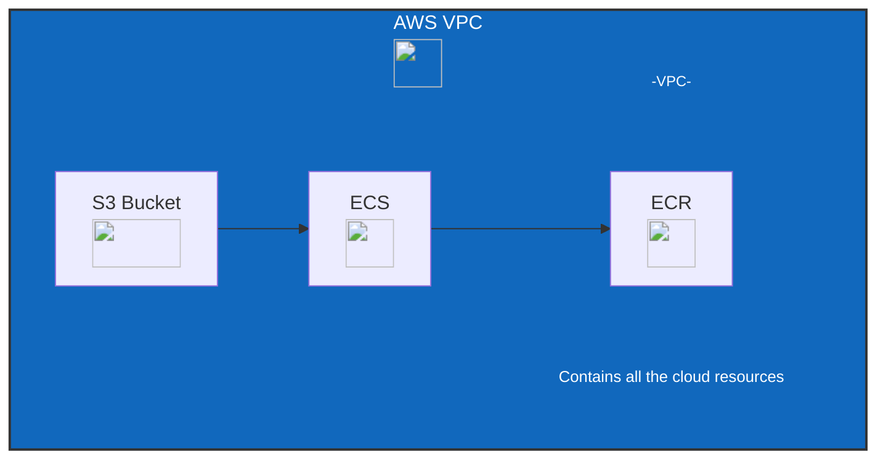

```mermaid
flowchart TB
    subgraph vpc [AWS VPC<br/><img src='https://a0.awsstatic.com/libra-css/images/logos/aws_logo_smile_1200x630.png' width='40' height='40'/>]
        hVPC[-VPC-]:::type
        dVPC[Contains all the cloud resources]:::description
        S3Bucket[S3 Bucket<br/><img src='https://symbols.getvecta.com/stencil_98/37_amazon-s3.a67a0a5f82.svg' width='40' height='40'/>] --> ECS[ECS<br/><img src='https://symbols.getvecta.com/stencil_98/69_amazon-ecs.16bca0a62d.svg' width='40' height='40'/>]
        ECS --> ECR[ECR<br/><img src='https://symbols.getvecta.com/stencil_98/38_amazon-ecr.d92d1dea7d.svg' width='40' height='40'/>]
    end
    vpc:::internalSystem

    %% Styling definitions
    classDef internalSystem fill:#1168bd,color:#fff,stroke:#333,stroke-width:2px;
    classDef type stroke-width:0px,color:#fff,fill:transparent,font-size:12px;
    classDef description stroke-width:0px,color:#fff,fill:transparent,font-size:13px;

    %% Apply styles to headers and descriptions
    class hVPC type;
    class dVPC description;
```
